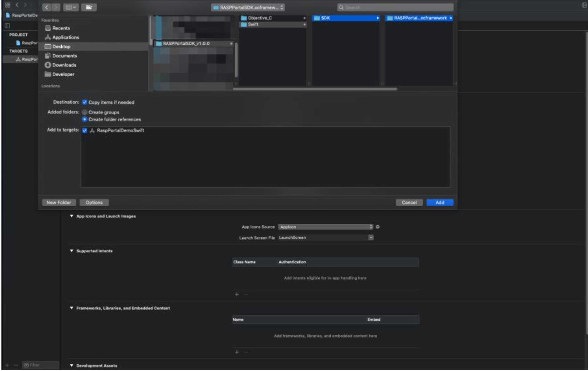
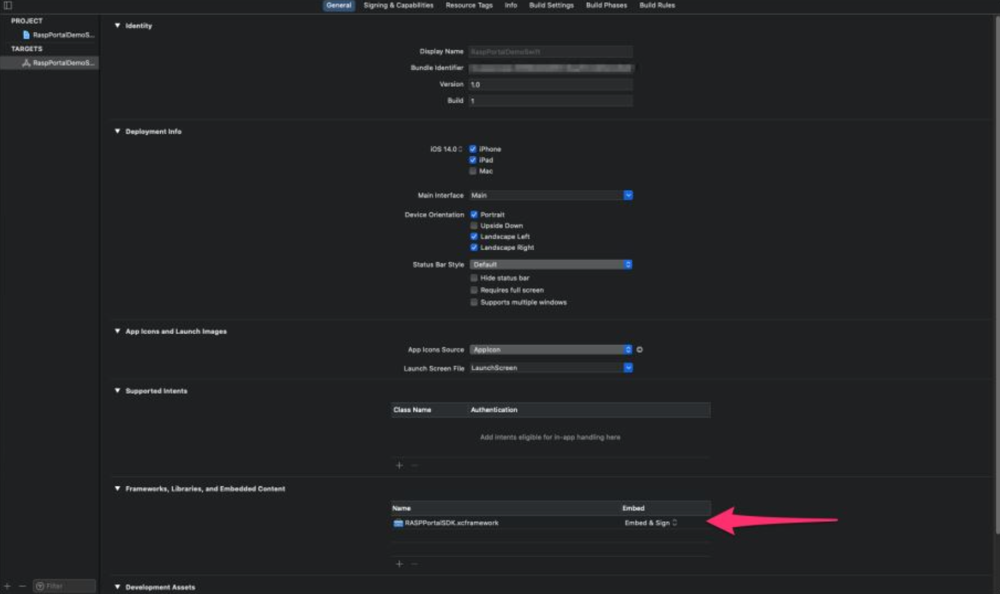

<h1 align=center>

</h1>

# 🔒📱 App Protector: Freemium RASP Solution for iOS

App Protector Freemium SDK enables limited threat detection on iOS devices. Supported detections include:
- Jailbreaking detection;
- Code Signature;
- Downloaded from trusted source verfication;

Supported reactions to detected threats:
- Notify the user.

## Youtube Tutorial

[](https://www.youtube.com/watch?v=ee8xtZJS6c0)

## Security Detections

### 🚧 Jailbreak Detection

Jailbreaking is the process of removing the limitations put in place by a device's manufacturer, generally performed on Apple iOS devices. App Protector detects if the device is jailbroken, checks for unwanted libraries, and verifies access permissions to suspicious directories.

## 🚨 Security Detections Reactions

### Notify User

When a security event is detected, App Protector notifies the application about the detected problem on the device. This information can be shown to the user. This reaction is at the information level, reporting the detected event.

## 🛠️ Freemium SDK iOS Integration

### SDK integration Adding SDK to iOS project

SDK can be downloaded from [here](https://cybersecurity.asee.io/downloads/app-protector-datasheet/).

SDK is delivered in a .zip format, where after unzipping, you will have an .xcframework file.

To import the said framework:
1. Go to  Add Files to .YourProjectName
a. Choose the appropriate .xcframework for your target.
b. Select Copy items if needed.
	
<h1 align=center>

</h1>

2. Make sure to Embed & Sign your frameworks.

<h1 align=center>

</h1>

## 📚 Classes and Methods Overview
The following classes, structures, and methods are available in RASPPortalSDK:

### RASPFacade

The main class of App Protector SDK used to trigger tampering detection.

### Detect on Demand
This method is used for a single on-demand App Protector detection. It expects one input parameter representing types of tampering to be detected. The method returns detected tampering or empty if no tampering is detected.

### Usage

```swift
let detectedTamperings = RASPFacade.detectOnDemand(raspConfiguration: [.JAILBREAK])
```


## 🛡️ Data Collection and Privacy
Freemium App Protector doesn't collect anonymized security diagnostics data for app and device instances.


# 💎 Freemium vs. Premium Model 
Explore our premium plan for additional features and unparalleled security.

<table>
  <thead>
    <tr>
      <th></th>
      <th>Free SDK</th>
      <th>Full SDK</th>
    </tr>
  </thead>
  <tbody>
    <tr>
      <td><strong>Jailbreak/Root Detection</strong></td>
      <td>✓</td>
      <td>✓</td>
    </tr>
    <tr>
      <td><strong>App Signature Integrity</strong></td>
      <td>✓</td>
      <td>❌</td>
    </tr>
    <tr>
      <td><strong>App Store Validation</strong></td>
      <td>✓</td>
      <td>❌</td>
    </tr>
    <tr>
      <td><strong>Debugging Mode Detection</strong></td>
      <td>❌</td>
      <td>✓</td>
    </tr>
    <tr>
      <td><strong>Hooking Framework Identification</strong></td>
      <td>❌</td>
      <td>✓</td>
    </tr>
    <tr>
      <td><strong>Simulator/Emulator Check</strong></td>
      <td>❌</td>
      <td>✓</td>
    </tr>
    <tr>
      <td><strong>Screen Recording Defense (only iOS)</strong></td>
      <td>❌</td>
      <td>✓</td>
    </tr>
    <tr>
      <td><strong>Obfuscation</strong></td>
      <td>❌</td>
      <td>✓</td>
    </tr>
    <tr>
      <td><strong>App Integrity Check</strong></td>
      <td>❌</td>
      <td>✓</td>
    </tr>
    <tr>
      <td><strong>Web Portal</strong></td>
      <td>❌</td>
      <td>✓</td>
    </tr>
  </tbody>
</table>


# 🤝 Community Contributions
Join our community and contribute to the ongoing development of App Protector. Whether it's filing issues, addressing existing ones, or enhancing our documentation, your contributions are appreciated.

# ℹ️ About Us
ASEE group is one of the biggest IT companies in the area of production and implementation of its own software solutions and services in the region of South Eastern Europe, Turkey, Spain, Portugal, Andorra, Colombia, Peru and the Dominican Republic.

ASEE provides products and services within the Payment business under Payten name. Since October 2009, the shares of Asseco South Eastern Europe (WSE: ASSECO SEE, ASE) have been listed on the Warsaw Stock Exchange.

# 📜 License
Freemium App Protector SDK is provided under a freemium model. Review the [LICENSE](https://github.com/assecosee/see.asee.ios.FreemiumAppProtector/blob/4a6a6e1b30fb04905dcd8c892251bc64280b3a3a/LICENSE) for detailed information.
